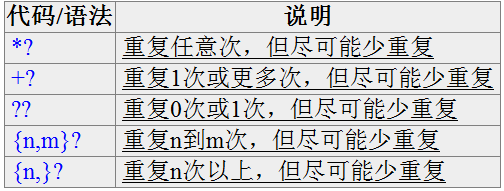

# 贪婪与懒惰

当正则表达式中包含能接受重复的限定符时，通常的行为是（在使整个表达式能得到匹配的前提下）匹配尽可能多的字符。以这个表达式为例：`a.*b`，它将会匹配最长的以 a 开始，以 b 结束的字符串。如果用它来搜索 aabab 的话，它会匹配整个字符串 aabab。这被称为贪婪匹配。

有时，我们更需要懒惰匹配，也就是匹配尽可能少的字符。前面给出的限定符都可以被转化为懒惰匹配模式，只要在它后面加上一个问号?。这样`.*?`就意味着匹配任意数量的重复，但是在能使整个匹配成功的前提下使用最少的重复。现在看看懒惰版的例子吧：

`a.*?b`匹配最短的，以 a 开始，以 b 结束的字符串。如果把它应用于 aabab 的话，它会匹配 aab（第一到第三个字符）和 ab（第四到第五个字符）。

为什么第一个匹配是 aab（第一到第三个字符）而不是ab（第二到第三个字符）？简单地说，因为正则表达式有另一条规则，比懒惰／贪婪规则的优先级更高：最先开始的匹配拥有最高的优先权——The match that begins earliest wins。

表 5.懒惰限定符

